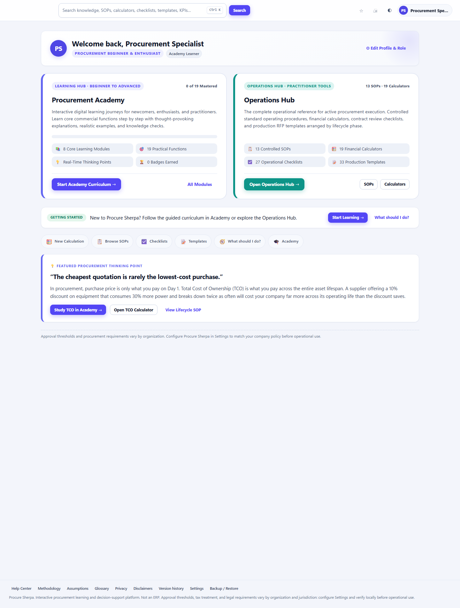
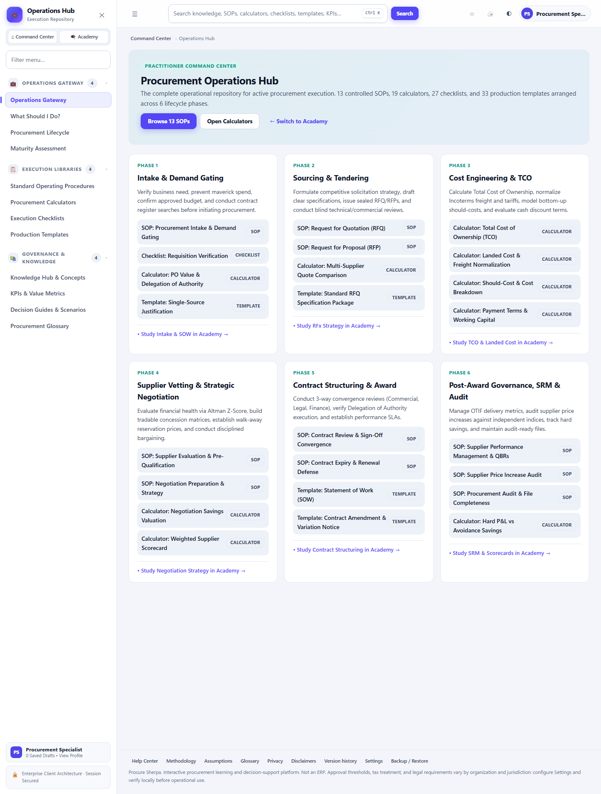
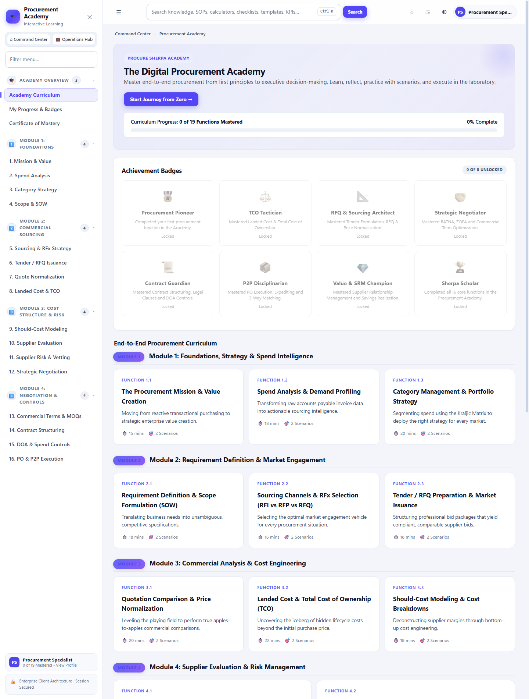
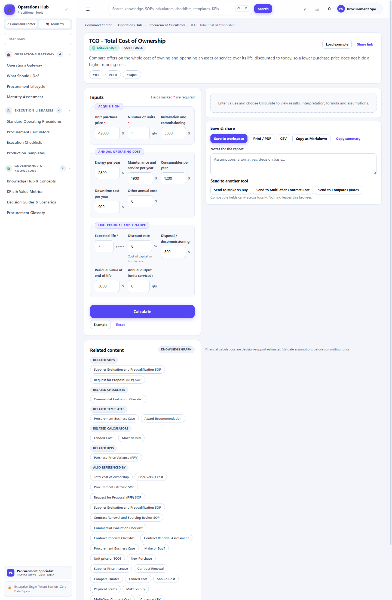
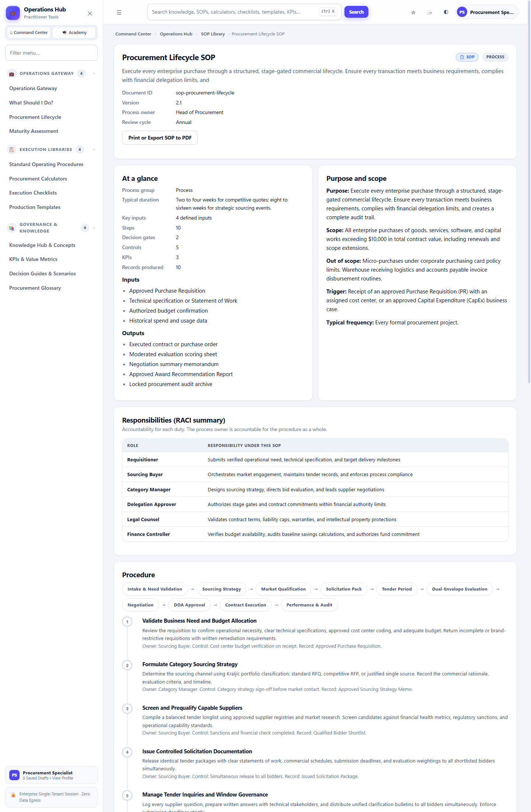

# Procure Sherpa

### Practical procurement expertise, built into your browser.

**A free learning and decision-support platform for procurement, sourcing, and supply chain professionals. No install, no login, no data ever leaves your device.**

[**🚀 Open Procure Sherpa →**](https://procuresherpa.vercel.app)

 

 

## What is Procure Sherpa?

**Procure Sherpa is a self-contained learning and decision-support toolkit for procurement, sourcing, and supply chain professionals,** built for anything from a first RFQ to running a full strategic sourcing event.

It brings structured competency training and practical working tools into one place: a guided curriculum for building procurement expertise, alongside the calculators, SOPs, and checklists needed to apply that expertise on real purchasing decisions.

No sign-up. No installation. No subscription. Open it in a browser tab and it works.

 

## What's inside

<table>
<tr>
<td width="50%" valign="top">

### 🎓 Procurement Academy
A structured curriculum covering the full procurement lifecycle: spend analysis, category strategy, sourcing, negotiation, contracting, and supplier management, taught through concepts, real-world thinking points, and interactive knowledge checks. Practice on simulated commercial crises before you face the real thing.

### 🧮 19 Financial Calculators
Compare quotes, work out landed cost, model total cost of ownership, size a negotiation target, and check a price-increase request against the numbers. Every calculator is built around a real procurement decision, not just a formula.

</td>
<td width="50%" valign="top">

### 📋 Controlled SOPs & Checklists
Ready-to-use standard operating procedures and compliance checklists for the moments that matter: intake, RFQ/RFP, contract review, supplier onboarding, emergency procurement, and audit prep.

### 📊 Visual Analytics
Spend Pareto curves, Kraljic portfolio matrices, cost waterfalls, and supplier risk gauges, rendered instantly from your own numbers, right in the browser.

</td>
</tr>
</table>

 

## Built for how procurement actually works

 

 

 

 

## Why people trust it with real numbers

- **Your data never leaves your browser.** Every calculation, saved template and checklist stays in local storage on your own device. Nothing is uploaded, tracked, or sold.
- **No account, no paywall.** The full toolkit is free to use, every time you open it.
- **Works offline.** Once loaded, it keeps working without an internet connection.
- **Honest, not hyped.** Procure Sherpa doesn't claim to be an ERP, and it doesn't issue credentials it isn't authorized to issue. What it tells you is exactly what it does, nothing dressed up.

 

## Try it now

### [**procuresherpa.vercel.app**](https://procuresherpa.vercel.app)

*Free. No install. No login. Works in any modern browser.*

 

## Documentation

- [Getting Started](docs/getting-started.md), how to open it and where to begin
- [FAQ](docs/faq.md), answers to the questions people ask most
- [Privacy](docs/privacy.md), where your data goes, in plain language

 

---

Built by **[Digi Tracks](https://digitracks.vercel.app)**, an independent software studio building offline-first tools that keep working when the internet doesn't.

📧 [digi.tracks@outlook.com](mailto:digi.tracks@outlook.com)

